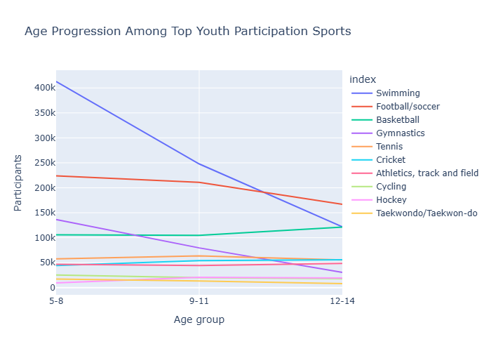
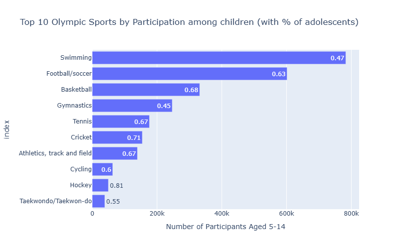
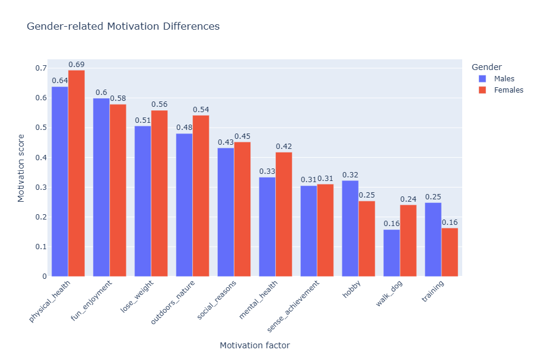
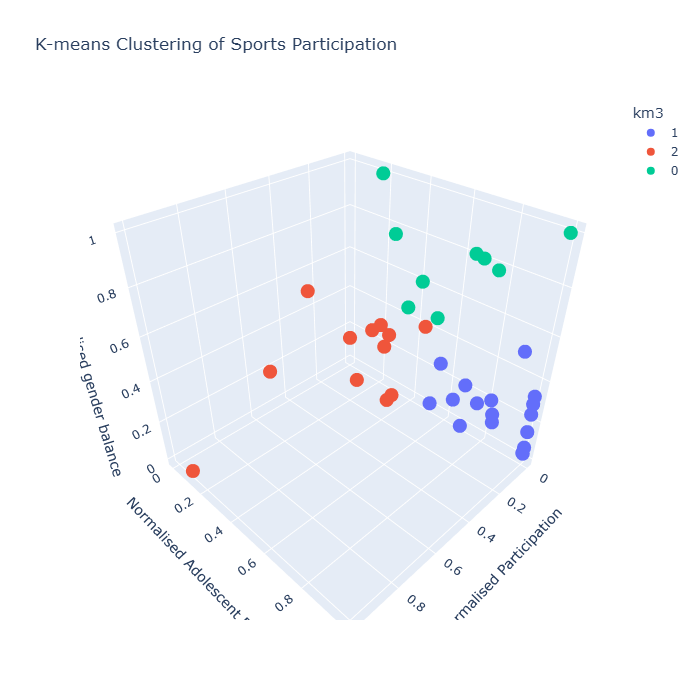

# brisbane-2032-youth-engagement-analytics
Python-based data analysis project identifying youth engagement insights through sports participation, media, and motivation datasets.

## Project Overview

This data analytics project explores Australian youth sport participation patterns, media coverage trends, and participation motivations to identify strategic opportunities for increasing youth engagement with the Brisbane 2032 Olympic Games.

The project integrates multiple datasets and applies exploratory data analysis (EDA), text analysis, visualisation techniques, and clustering methods to generate evidence-based recommendations.

---

## Business Problem

The Brisbane 2032 Olympic Games presents an opportunity to increase youth participation and long-term engagement with sports.

This project aims to answer:

**"How can data-driven insights help improve youth engagement strategies for Brisbane 2032?"**

Key analytical questions include:

- Which sports have the strongest youth participation potential?
- How is Olympic-related content represented in digital media?
- What factors motivate different groups to participate in sport?
- How can audience segmentation support targeted engagement strategies?

---

## Dataset Overview

Multiple data sources were analysed to provide a comprehensive understanding of youth engagement.

| Dataset | Purpose |
|---|---|
| Sports Participation Data | Identify youth participation trends across different sports |
| Media Coverage Data | Analyse Olympic-related topics and digital engagement themes |
| Motivation Data | Understand key factors influencing sport participation |

---

## Technologies Used

- Python
- Jupyter Notebook
- Pandas
- NumPy
- Matplotlib
- Seaborn
- Scikit-learn
- Natural Language Processing (NLP)

---

## Analytical Methods

### 1. Data Cleaning & Preparation

Performed preprocessing steps including:

- Handling missing values
- Data transformation
- Feature preparation
- Dataset restructuring for analysis


### 2. Exploratory Data Analysis (EDA)

Analysed:

- Youth participation distribution
- Popular sports categories
- Age-based participation patterns
- Gender participation differences


### 3. Media Content Analysis

Applied text analytics techniques to examine:

- Olympic-related media topics
- Youth-focused content representation
- Digital engagement themes


### 4. Motivation Analysis

Investigated participation drivers including:

- Physical health
- Enjoyment
- Social connection
- Lifestyle factors


### 5. Segmentation Analysis

Applied clustering techniques to identify different participant groups based on behavioural and motivational patterns.

---

## Key Findings

### Youth Sport Participation

- Swimming and soccer demonstrated strong overall youth participation.
- Basketball showed high potential among adolescent participants.
- Different sports displayed varying engagement patterns across age groups.


### Media Engagement

- Olympic media coverage was strongly focused on event organisation, safety, and regulation.
- More youth-oriented digital engagement strategies may improve connection with younger audiences.


### Participation Motivation

The strongest participation drivers identified were:

1. Physical health
2. Enjoyment and fun
3. Fitness improvement
4. Social interaction


---

## Data Analysis Workflow

```text
Raw Data Collection
        |
        v
Data Cleaning & Transformation
        |
        v
Exploratory Data Analysis
        |
        v
Visualisation & Pattern Discovery
        |
        v
Clustering / Segmentation Analysis
        |
        v
Strategic Recommendations
```

---

## Example Visualisations

### Youth Participation Analysis




### Motivation Analysis




### Segmentation Results




---

## Project Outcomes

This project produced:

- A structured analysis of youth sport participation trends
- Insights into Olympic-related media communication patterns
- Identification of key participation motivations
- Audience segmentation for targeted engagement strategies
- Data-driven recommendations for Brisbane 2032 youth engagement planning


---

## Skills Demonstrated

- Data Cleaning
- Exploratory Data Analysis
- Data Visualisation
- Statistical Analysis
- Text Analytics
- Machine Learning (Clustering)
- Insight Generation
- Business Recommendation Development


---

## Repository Structure

```text
brisbane-2032-youth-engagement-analytics/

├── notebooks/
│   └── Olympic_Youth_Engagement_Analysis.ipynb
│
├── data/
│
├── images/
│
├── README.md
│
├── requirements.txt
│
└── .gitignore
```

---

## Author

Developed as a data analytics project focusing on applying analytical techniques to real-world sports engagement and strategic planning challenges.
